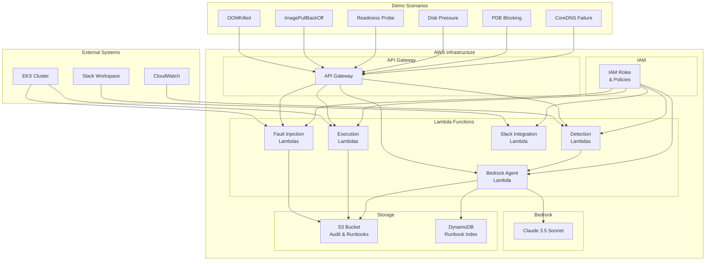

# EKS Chaos Guardian - Architecture Documentation

## Overview

EKS Chaos Guardian is an autonomous AI agent that performs intelligent chaos engineering on Amazon EKS clusters to ensure resilience and reliability. The system uses Amazon Bedrock with Claude 3.5 Sonnet for reasoning, integrates with AWS services for monitoring and execution, and implements a comprehensive runbook system for learning and reuse.

## System Architecture



## Component Details

### 1. Bedrock AgentCore Integration

**Purpose**: Orchestrates the AI reasoning and decision-making process

**Components**:
- **Claude 3.5 Sonnet**: Foundation model for analysis and planning
- **System Prompts**: SRE-focused instructions for failure analysis
- **Tool Integration**: Connects to detection, execution, and notification tools

**Key Features**:
- Root cause analysis with evidence correlation
- Risk assessment and autonomy mode handling
- Remediation plan generation
- Runbook matching and creation

### 2. Fault Injection System

**Purpose**: Inject controlled failures into EKS clusters for testing

**Lambda Functions**:
- `node_failure.py`: Cordon and terminate worker nodes
- `pod_eviction.py`: Evict pods with PDB respect
- `network_latency.py`: Inject network latency via sidecar
- `api_throttling.py`: Simulate API throttling conditions

**Safety Features**:
- Dry-run mode for all operations
- PDB constraint checking
- Risk-based execution controls

### 3. Detection System

**Purpose**: Monitor and detect failure conditions in real-time

**Lambda Functions**:
- `cloudwatch_logs.py`: Query CloudWatch Logs Insights
- `cloudwatch_metrics.py`: Analyze CloudWatch metrics
- `k8s_events.py`: Monitor Kubernetes events

**Detection Patterns**:
- OOMKilled containers
- ImagePullBackOff errors
- Readiness probe failures
- CrashLoopBackOff conditions
- Node disk pressure
- Network connectivity issues

### 4. Execution System

**Purpose**: Execute remediation actions safely

**Lambda Functions**:
- `k8s_operations.py`: Kubernetes resource operations
- `asg_operations.py`: Auto Scaling Group management
- `service_operations.py`: Service-level operations

**Supported Operations**:
- Deployment patches and restarts
- Resource scaling (HPA, replicas)
- Node cordoning and draining
- Image and configuration updates

### 5. Runbook System

**Purpose**: Learn from successful remediations and reuse patterns

**Storage**:
- **S3**: Stores complete runbook JSON files
- **DynamoDB**: Indexes runbooks by pattern and cluster

**Runbook Structure**:
```json
{
  "runbook_version": "1.0",
  "pattern_id": "k8s_oomkilled",
  "match": {
    "signals": ["Reason=OOMKilled"],
    "metrics": [{"name": "memory_usage", "op": ">", "value": "limit"}]
  },
  "plan": [
    {"action": "patch_deployment_resources", "params": {"memory_limit": "512Mi"}},
    {"action": "rollout_restart", "params": {}}
  ],
  "risk": "low",
  "requires_approval": false
}
```

### 6. Slack Integration

**Purpose**: Provide notifications and approval workflows

**Features**:
- Real-time failure notifications
- Interactive approval buttons
- Remediation progress updates
- Evidence and plan summaries

## Data Flow

### 1. Chaos Injection Flow

```
Demo Scenario → API Gateway → Fault Injection Lambda → EKS Cluster
                                    ↓
                            S3 Audit Storage
```

### 2. Detection and Analysis Flow

```
CloudWatch Logs/Metrics → Detection Lambda → Bedrock Agent
                                              ↓
                                        Claude Analysis
                                              ↓
                                        Remediation Plan
```

### 3. Execution Flow

```
Remediation Plan → Execution Lambda → K8s Operations → EKS Cluster
                                       ↓
                              Slack Notifications (if approval needed)
                                       ↓
                              Verification & Runbook Storage
```

## Security Architecture

### IAM Roles and Policies

**Lambda Execution Role**:
- CloudWatch Logs read access
- CloudWatch Metrics read access
- EKS cluster read/write access (scoped)
- S3 bucket read/write access
- DynamoDB read/write access
- Bedrock model invoke access

**EKS Node Group Role**:
- EC2 instance termination (scoped to demo nodes)
- EKS cluster access
- CloudWatch metrics publishing

### Network Security

- VPC isolation for EKS cluster
- Private subnets for worker nodes
- NAT Gateway for outbound internet access
- Security groups with least-privilege access

### Data Protection

- S3 server-side encryption (SSE-S3)
- DynamoDB encryption at rest
- TLS encryption in transit
- PII redaction before LLM processing

## Monitoring and Observability

### CloudWatch Dashboards

**Chaos Guardian Dashboard**:
- Detection rate and success metrics
- Remediation execution times
- Auto vs manual action ratios
- Runbook match rates

**EKS Cluster Dashboard**:
- Node health and resource utilization
- Pod status and restart counts
- Service availability metrics
- Network and storage metrics

### Logging

**Structured Logging**:
- Correlation IDs for request tracing
- JSON format for easy parsing
- Log levels: INFO, WARN, ERROR
- CloudWatch Logs integration

**Audit Trail**:
- All actions logged to S3
- Before/after state capture
- Approval decisions recorded
- Runbook creation and usage

## Performance Characteristics

### Latency Targets

- **Detection**: ≤ 60 seconds from failure start
- **Analysis**: ≤ 30 seconds for plan generation
- **Execution**: ≤ 2 minutes for low-risk actions
- **Verification**: ≤ 5 minutes for recovery confirmation

### Scalability

- **Concurrent Clusters**: Up to 5 EKS clusters
- **Scenarios per Hour**: Up to 10 chaos scenarios
- **Lambda Concurrency**: 100 concurrent executions
- **API Gateway**: 10,000 requests per second

### Availability

- **Lambda Functions**: 99.9% availability target
- **API Gateway**: 99.95% availability target
- **S3**: 99.999999999% durability
- **DynamoDB**: 99.99% availability target

## Cost Optimization

### Resource Optimization

- Lambda functions use minimal memory allocation
- S3 lifecycle policies for log retention
- DynamoDB on-demand billing
- EKS cluster auto-scaling

### Cost Monitoring

- AWS Cost Explorer integration
- Budget alerts for unexpected usage
- Resource tagging for cost allocation
- Demo environment cleanup automation

## Deployment Architecture

### Infrastructure as Code

- **Terraform**: Complete infrastructure provisioning
- **Modular Design**: Reusable components
- **Environment Isolation**: Separate demo/prod environments
- **State Management**: Remote state with locking

### CI/CD Pipeline

- **GitHub Actions**: Automated testing and deployment
- **Lambda Deployment**: Automated function updates
- **Infrastructure Updates**: Terraform plan/apply automation
- **Rollback Capability**: Previous version restoration

## Disaster Recovery

### Backup Strategy

- **S3 Cross-Region Replication**: Runbook backup
- **DynamoDB Point-in-Time Recovery**: Runbook index backup
- **Infrastructure Templates**: Terraform state backup
- **Configuration Backup**: Lambda code and configuration

### Recovery Procedures

- **RTO (Recovery Time Objective)**: 4 hours
- **RPO (Recovery Point Objective)**: 1 hour
- **Failover Process**: Manual with documented procedures
- **Testing**: Quarterly disaster recovery drills

## Compliance and Governance

### Audit Requirements

- **Action Logging**: All operations logged with timestamps
- **Access Logging**: IAM role usage and API calls
- **Change Management**: Infrastructure and code changes tracked
- **Approval Workflows**: Human approval for high-risk actions

### Compliance Standards

- **SOC 2**: Security and availability controls
- **PCI DSS**: If processing payment data
- **HIPAA**: If handling healthcare data
- **GDPR**: Data privacy and protection

## Future Enhancements

### Planned Features

1. **Multi-Region Support**: Cross-region chaos testing
2. **Advanced ML**: Predictive failure detection
3. **GitOps Integration**: Automated runbook updates
4. **Custom Metrics**: Application-specific monitoring
5. **Chaos Engineering UI**: Web-based management interface

### Scalability Improvements

1. **EventBridge Integration**: Event-driven architecture
2. **Step Functions**: Complex workflow orchestration
3. **Container Images**: Lambda container support
4. **Edge Computing**: Regional deployment optimization

This architecture provides a robust, scalable, and secure foundation for autonomous chaos engineering on AWS EKS, meeting the requirements for the AWS AI Agent Hackathon while demonstrating best practices in cloud-native application design.
